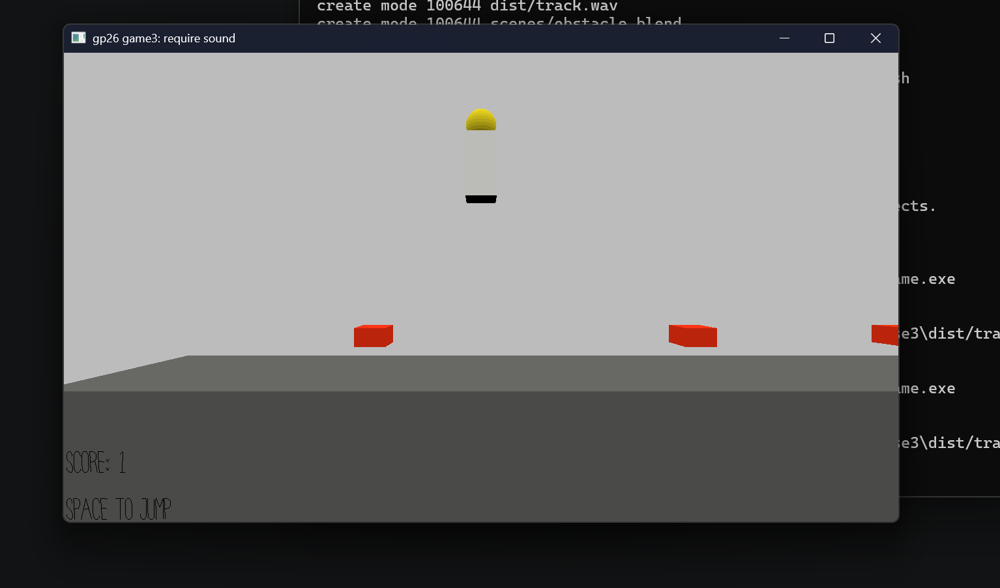

# Beat Leap

Author: Jerry Wang (jerrywa2)

Design: It is a platformer that takes the combo system for rhythm games and ties it to the mechanic of jumping, where successful combos result in higher jumps.

Screen Shot:

How To Play:

Press Spacebar to jump. Jump on the beat to jump higher and clear higher obstacles!

This game was built with [NEST](NEST.md).
